<picture>
  <source media="(prefers-color-scheme: dark)" srcset="./assets/header-dark.svg">
  <source media="(prefers-color-scheme: light)" srcset="./assets/header-light.svg">
  
</picture>

  

 

## What I do

I build cross-platform apps in **Flutter** and the backends that keep them running. Most of my work starts at the data model and ends at the last pixel — I'd rather own a feature end to end than hand it across three teams.

Right now I'm going deeper on backend architecture and on the motion details that make a mobile UI feel finished rather than functional.

**Open to** freelance work, collaboration on mobile or full stack projects, and interesting problems that don't have an obvious answer yet.

 

## Selected work

<table>
<tr>
<td width="33%" valign="top">

### Project One
Solves a specific problem for a specific person — say who and what in one line.

`Flutter` `Firebase`

[Code](https://github.com/Git-moud1) · [Demo](#)

</td>
<td width="33%" valign="top">

### Project Two
Solves a specific problem for a specific person — say who and what in one line.

`Node.js` `MySQL`

[Code](https://github.com/Git-moud1) · [Demo](#)

</td>
<td width="33%" valign="top">

### Project Three
Solves a specific problem for a specific person — say who and what in one line.

`Dart` `REST API`

[Code](https://github.com/Git-moud1) · [Demo](#)

</td>
</tr>
</table>

 

## Toolkit

**Daily**

<b>Everything else I work with</b>

 

| Layer | Tools |
|---|---|
| **Mobile** | Flutter · Dart · Material · Provider / Riverpod |
| **Frontend** | JavaScript · HTML5 · CSS3 |
| **Backend** | Node.js · PHP · Python · REST APIs |
| **Data** | Firebase · MySQL |
| **Workflow** | Git · GitHub Actions · VS Code · Android Studio |

 

## By the numbers

<picture>
  <source media="(prefers-color-scheme: dark)" srcset="https://github-readme-stats.vercel.app/api?username=Git-moud1&show_icons=true&hide_border=true&include_all_commits=true&count_private=true&bg_color=0B1220&title_color=13B9FD&icon_color=FFCA28&text_color=E6EDF5&border_radius=12">
  
</picture>
<picture>
  <source media="(prefers-color-scheme: dark)" srcset="https://github-readme-stats.vercel.app/api/top-langs/?username=Git-moud1&layout=compact&hide_border=true&langs_count=6&bg_color=0B1220&title_color=13B9FD&text_color=E6EDF5&border_radius=12">
  
</picture>

  

<picture>
  <source media="(prefers-color-scheme: dark)" srcset="https://raw.githubusercontent.com/Git-moud1/Git-moud1/output/snake-dark.svg">
  <source media="(prefers-color-scheme: light)" srcset="https://raw.githubusercontent.com/Git-moud1/Git-moud1/output/snake-light.svg">
  
</picture>

 

## Get in touch

The fastest way to reach me is **[baymed000@gmail.com](mailto:baymed000@gmail.com)**. I read everything, and I answer anything that isn't a template.

 
<code>@Git-moud1</code> · built with Flutter, coffee, and too many hot reloads

